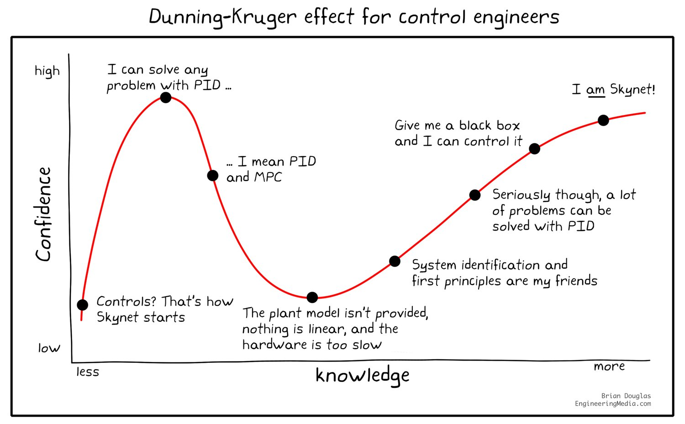
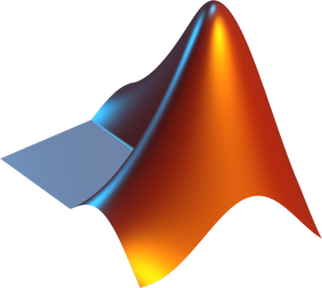

  

<h2 align="center">🤖 Technologist in Humanoid Robotics at <a href="https://www.iit.it/web/icub-tech">iCub–Tech@IIT</a></h2>
<h2 align="center">:octocat: GitHub <a href="https://github.com/education/teachers">Campus Advisor</a></h2>

- 🤖 I’m coordinating a facility at [IIT](https://iit.it) to design, build, and develop **Embodied Systems** and **Humanoid Robots**
- 📝 I sometimes post articles on the [Robotology Community](https://github.com/robotology/community/discussions)
- 💬 Ask me about **Humanoid Robotics, Control / Software / Digital Engineering, Optimization, Real-Time Systems, EdTech**
- 📫 How to reach me **ugo.pattacini@iit.it**
- 📄 Know about my experiences [https://iit.it/people/ugo-pattacini](https://iit.it/people/ugo-pattacini)
- ✨ [**`Contribution Skyline`**](./assets/github-user-skyline.stl)
- 📜 [**`My GitHub Résumé`**](https://resume.github.io/?pattacini)

  

 
### Connect with me

<picture>
  <source media="(prefers-color-scheme: dark)" srcset="./assets/github-user-contribution-dark.svg" />
  <source media="(prefers-color-scheme: light)" srcset="./assets/github-user-contribution.svg" />
  
</picture>
